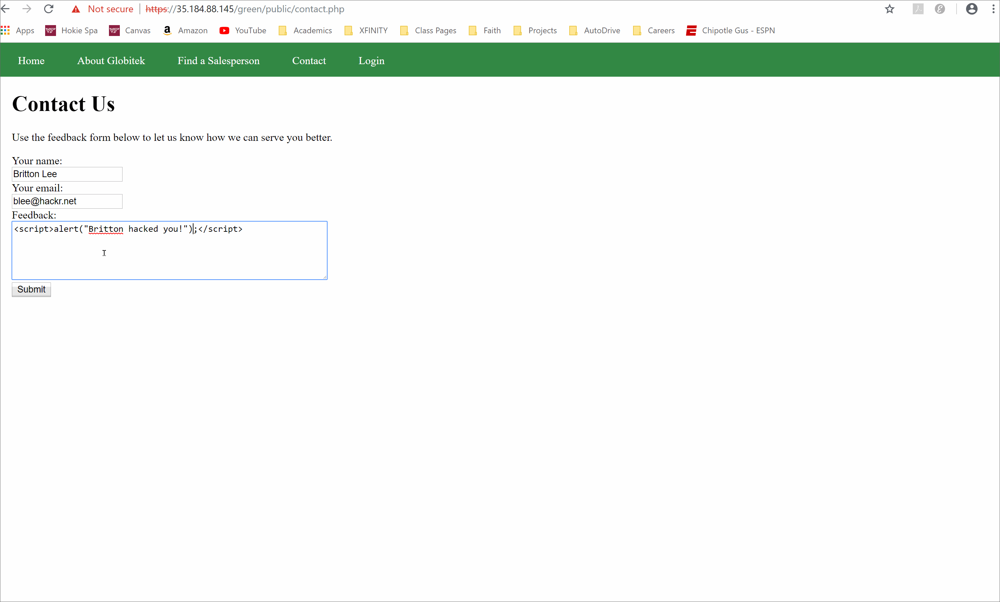
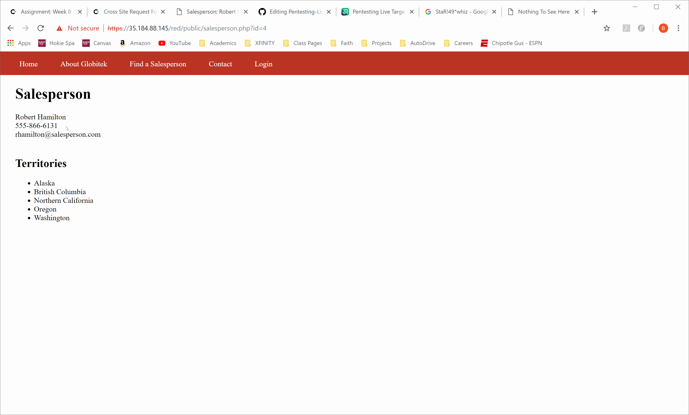

# Project 8 - Pentesting Live Targets

Time spent: **5** hours spent in total

> Objective: Identify vulnerabilities in three different versions of the Globitek website: blue, green, and red.

The six possible exploits are:
* Username Enumeration
* Insecure Direct Object Reference (IDOR)
* SQL Injection (SQLi)
* Cross-Site Scripting (XSS)
* Cross-Site Request Forgery (CSRF)
* Session Hijacking/Fixation

Each version of the site has been given two of the six vulnerabilities. (In other words, all six of the exploits should be assignable to one of the sites.)

## Blue

Vulnerability #1: Session Hijacking

* Simply log in on one browser, obtain the session id, and change the session id in the other browser to that id. Once the attacker clicks login, the actual login page is bypassed and the attacker has admin access.

Vulnerability #2: SQL Injection (SQLi)

* The blue site doesn't sanitize sql properly, so it is easy to put a sample piece of code like SLEEP in the url to show the vulnerability. If you watch the search bar carefully, you can see that the webpage waits for 5 seconds before returning.

## Green

Vulnerability #1: Username Enumeration

* The developer made the careless mistake of printing a bolded response if the username exists and a regular response if not.
* This makes it clear to a hacker which usernames are valid and able to be further attacked.

Vulnerability #2: Cross-Site Scripting (XSS)

* Putting an alert script in the feedback page shows this vulnerability clearly. Once the admin views the feedback, the script is triggered and the alert appears on the screen.

## Red

Vulnerability #1: Insecure Direct Object Reference (IDOR)

* Since the salesperson ids are low, consecutive numbers, it is easy to find all salespeople in the system simply by changing the id in the url.
* The other two sites mitigate this by redirecting the user back to the "Find a Salesperson" page if the id is not a valid public one.

Vulnerability #2: Cross-Site Request Forgery (CSRF)

* This vulnerability, while a bit trickier to exploit, was able to be viewed by changing salesperson data. A user could put a link to the malicious form in the feedback section which is executed once the admin follows the link.
* The script is able to change information about a salesperson.

## Notes

Describe any challenges encountered while doing the work
